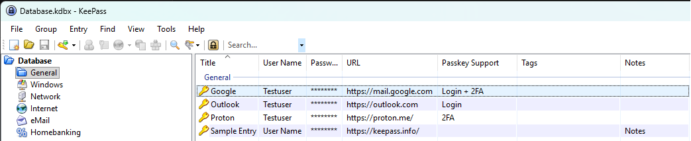
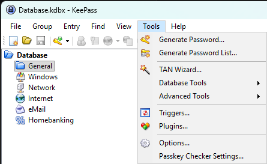
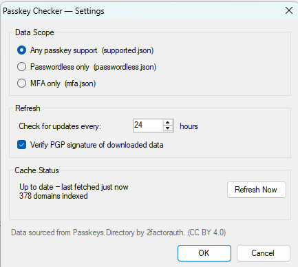

# KPPasskeyChecker

**A KeePass 2.x plugin that shows which of your saved sites support passkeys.**


**KPPasskeyChecker** adds a **Passkey Support** column to your KeePass
entry list. For each entry it looks up the entry's domain in the
[Passkeys Directory](https://passkeys.2fa.directory/) maintained by
[2factorauth](https://2fa.directory/) and tells you whether that site supports passkeys —
and whether it offers passwordless sign-in, passkeys as a second factor (2FA), or both.

KPPasskeyChecker is **informational only**: it tells you which websites support passkeys so you know
where you could enable one. It does not create, store, or manage passkeys (or any other
credentials) and never modifies your entries — it only reads each entry's website address to
look it up in the directory.



> **Status:** early prerelease (`0.1.0`). The support column, settings dialog, signature
> verification and update check work today. Richer UI (entry context menu, search and detail
> views) is planned — see the roadmap below.

## Features

- **Passkey Support column** in the main entry list, showing `Login`, `2FA`, or `Login + 2FA`
  for each entry's domain (blank when the site is not in the directory).
- **Smart domain matching.** The lookup walks from the full host down to the registrable
  domain (eTLD+1, using the Public Suffix List), so `mail.example.co.uk` matches an
  `example.co.uk` entry, most-specific first.
- **Configurable scope.** Show any passkey support, or only passwordless, or only MFA.
- **Offline-friendly caching.** The directory is fetched on a configurable interval and cached
  locally; if a refresh fails, the last known-good data keeps working.
- **PGP signature verification (on by default).** The downloaded directory is verified against
  2factorauth's pinned RSA‑4096 code‑signing key before it is used; you can opt out in settings.
- **Update check.** Integrates with KeePass's built-in plugin update check so you're notified
  when a new version is available.

## Installation

KPPasskeyChecker ships in two interchangeable formats — both are built from the same source and behave
identically, so pick whichever you prefer:

| Format | What it is | Choose it if… |
| --- | --- | --- |
| **`.plgx`** | Source package KeePass compiles on first load | You want the conventional KeePass plugin format |
| **`.dll`** | Precompiled, self-contained assembly (single file, no extra dependencies) | You'd rather skip the on-load compile step |

1. Download **either** `KPPasskeyChecker.plgx` **or** `KPPasskeyChecker.dll` from the
   [Releases](https://github.com/gusowski1/KPPasskeyChecker/releases) page.
2. Close KeePass.
3. Copy the file into your KeePass **`Plugins`** folder
   (next to `KeePass.exe`, e.g. `C:\Program Files\KeePass Password Safe 2\Plugins\`).
4. Start KeePass. Open **Tools → Plugins** to confirm *KPPasskeyChecker* is listed.

> Install only **one** of the two. The `.plgx` is compiled on first load, so allow a moment the
> first time; the `.dll` loads immediately.

## Usage

**Show the column:** right‑click the entry-list column header (or use **View → Configure
Columns…**) and enable **Passkey Support**.

**Open settings:** **Tools → Passkey Checker Settings…**



The first time it runs, KPPasskeyChecker downloads the directory in the background; the column fills in
once the data arrives.

### What the column shows

| Value | Meaning |
| --- | --- |
| **Login** | You can sign in with a passkey *instead of* your password (passwordless). |
| **2FA** | A passkey / security key is supported as a *second factor* — on top of your password. |
| **Login + 2FA** | Both of the above. |
| *(blank)* | The site isn't in the directory. |

> **2FA** here means *a passkey/security key used as a second factor* (e.g. a hardware key in
> addition to your password) — **not** generic two-factor auth such as a TOTP authenticator app.

### Settings

| Setting | Description | Default |
| --- | --- | --- |
| **Data scope** | Show *any* passkey support, *passwordless only*, or *MFA only*. | Any |
| **Refresh interval** | How often (in hours) to check the directory for updates. | 24 |
| **Verify PGP signature** | Download and verify the signed data before using it (see below). | On |

The settings dialog also shows the cache status (last refresh, number of domains indexed) and
has a **Refresh Now** button.



## How it works

- **Data source.** The plugin fetches one of `supported.json`, `passwordless.json` or
  `mfa.json` from `https://passkeys-api.2fa.directory/v1/` depending on the configured scope,
  using conditional `If-None-Match` requests so unchanged data isn't re-downloaded.
- **Domain matching.** Hosts are reduced to candidate domains via the
  [Public Suffix List](https://publicsuffix.org/) and checked most-specific first.
- **Caching.** Content and metadata are cached under
  `%LocalAppData%\KeePassPluginCache\KPPasskeyChecker\`. Writes are atomic, and a failed
  refresh falls back to the cached copy.
- **Signature verification (on by default).** With *Verify PGP signature* enabled (the default),
  the plugin downloads the corresponding `.json.sig` — a compressed OpenPGP message that embeds the JSON
  and an RSA‑4096 / SHA‑512 signature — verifies it against 2factorauth's
  [pinned signing key](https://2fa.directory/api/) (fingerprint `0D504141…CBABC36D`), and uses
  the embedded, verified JSON. Verification is fail‑closed: it never falls back to unverified
  data. No third-party crypto library is bundled; verification uses only the .NET BCL.
- **Update check.** KeePass periodically reads the plugin's `UpdateUrl` and compares it against
  the installed version. It only *notifies* you; it never downloads or installs anything
  automatically.

## Privacy

KPPasskeyChecker **sends none of your data** — no entries, URLs, passwords, search queries, or telemetry.
It only *downloads* the public passkey directory; which entries your database holds and which sites
you look up **never leave your machine** — all domain matching happens locally against the cached
directory.

The only outbound traffic is plain HTTPS `GET` requests for public, non-personal data:

- `passkeys-api.2fa.directory` — the passkey directory (and its `.sig` when verification is on).
- `publicsuffix.org` — the Public Suffix List (cached for 7 days).
- `raw.githubusercontent.com` — the plugin's version file, only when KeePass checks for updates.

Those requests carry only a standard `User-Agent` and (for caching) an `If-None-Match` ETag —
nothing about you or your vault.

## Building from source

**Prerequisites**

- Windows with the .NET Framework 4.8 developer tooling.
- A copy of **`KeePass.exe`** — it is **not included in this repository** (and not on NuGet), so
  you must supply your own. The `KeePass.exe` from the **portable** KeePass 2.x release is enough —
  no KeePass installation is required. It is used for packaging and as a compile reference, but is
  never bundled into the output. Provide it in one of these ways:
  - place your `KeePass.exe` at `Libs\KeePass.exe` (the default location the build looks for), **or**
  - run `.\build.ps1 -KeePassExe "C:\path\to\KeePass.exe"` to point at an existing install, **or**
  - when building in Visual Studio, set the `KeePass` reference's `HintPath` to your copy.

**Build**

```powershell
.\build.ps1
```

This produces **both** shipping formats in `build\` (printing each one's size and SHA‑256):
`KPPasskeyChecker.plgx` (packaged with `KeePass.exe --plgx-create`, compiled by KeePass on load)
and `KPPasskeyChecker.dll` (the same sources compiled into a single self-contained assembly). To
install, copy **either one** into your KeePass `Plugins` folder and restart KeePass.

Target framework is .NET Framework 4.8; the UI is WinForms. The plugin is self-contained — all
shared code is compiled into the plugin assembly.

## Roadmap

- Entry context-menu action and a per-entry detail view.
- A search/browse window over the directory.
- Better error UX for a failed manual refresh.
- Optional signing of the update version file.

## Data source & attribution

Passkey data is provided by the **Passkeys Directory** maintained by **2factorauth**, licensed
under [CC BY 4.0](https://creativecommons.org/licenses/by/4.0/). Browse the same data at
**[passkeys.2fa.directory](https://passkeys.2fa.directory/)** (the plugin reads its API at
`passkeys-api.2fa.directory`). The data is crowdsourced — report a missing or incorrect entry at
**[github.com/2factorauth/passkeys](https://github.com/2factorauth/passkeys)**.

## License

KPPasskeyChecker is licensed under the **GNU General Public License v3.0** — see [LICENSE](LICENSE).

The passkey *data* is provided by the Passkeys Directory and is separately licensed under
[CC BY 4.0](https://creativecommons.org/licenses/by/4.0/), as noted above.

## Acknowledgements

The idea for KPPasskeyChecker was inspired by [KP2faChecker](https://github.com/tiuub/KP2faChecker) by
tiuub (licensed under Apache 2.0), which adds a two-factor-authentication support column to
KeePass. KPPasskeyChecker applies the same idea to passkeys.
